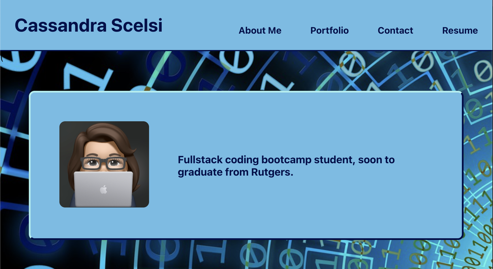
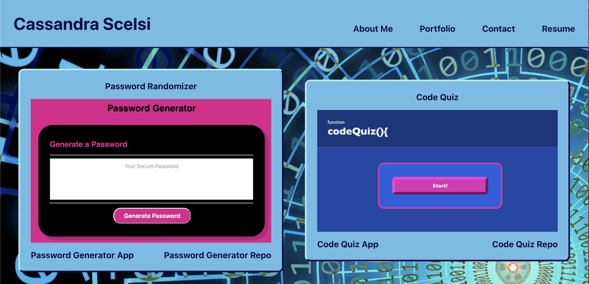
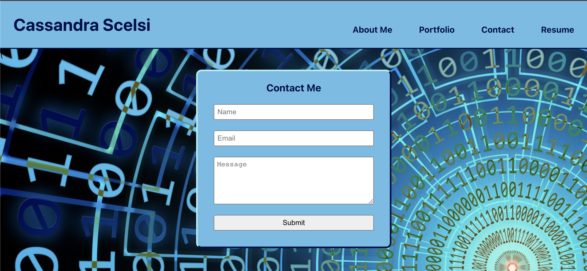
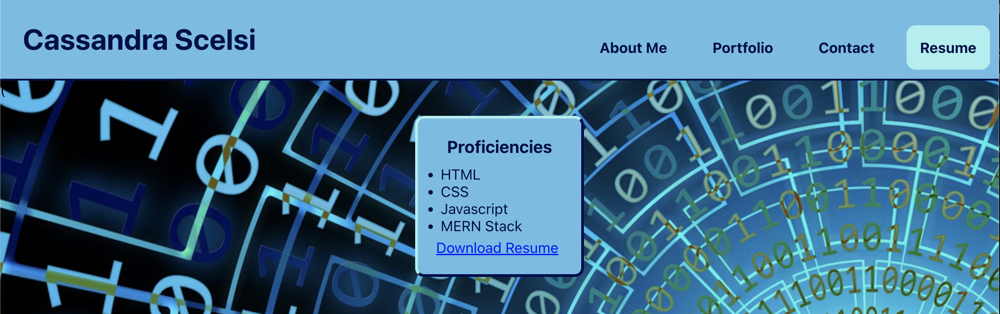

# Professional Portfolio

## Description

Cassandra Scelsi's Professional Portfolio, featuring apps and contact information.

## Usage

About Me

Portfolio

Contact Me

Resume

## Credits

- https://github.com/priyaravi23/react-portfolio
- https://www.knowledgehut.com/blog/web-development/install-react-on-mac
- https://www.w3schools.com/css/css3_variables.asp
- https://colorhunt.co/palette/ff55bbffd3a3fcffb2b6eafa
- https://colorhunt.co/palette/8294c4acb1d6dbdfeaffead2
- https://htmlcolorcodes.com
- https://www.youtube.com/watch?v=bmpI252DmiI
- https://www.jsdiaries.com/how-to-remove-html-purple-link-an-easy-solution/#:~:text=A%20purple%20link%20can%20be,the%20CSS%20%3Avisited%20pseudo%20class
- https://colorhunt.co/palette/00ead3fff5b7ff449f005f99
- https://htmlcolorcodes.com
- https://www.w3schools.com/cssref/sel_hover.php
- https://www.w3schools.com/css/css_background_image.asp
- https://pixabay.com/illustrations/binary-code-binary-code-zero-one-4791836/
- https://stackoverflow.com/questions/23027649/set-background-image-to-cover-according-to-viewport-size
- https://github.com/jdtdesigns/react_playground/tree/conditional-rendering
- https://www.youtube.com/watch?v=4oCVDkb_EIs
- Tutoring 09MAY2023
- https://github.com/scelsic2/professional-portfolio/blob/main/index.html
- https://www.w3schools.com/tags/tag_textarea.asp
- https://www.npmjs.com/package/react-download-link

## License

MIT License

## Deployed Application Link

Paste your deployed application link here.

https://scelsic2.github.io/
